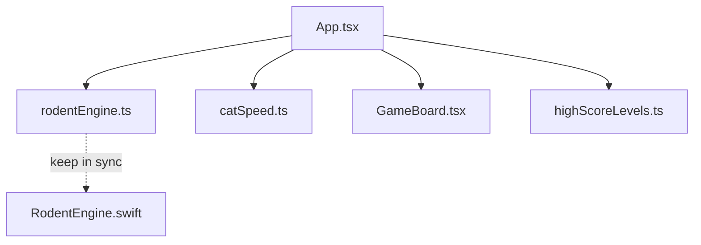

# Rodent's Revenge — Hand-off

> Agent hand-off document for **Rodent's Revenge** web prototype and the sibling iOS engine port.  
> **Web repo:** `Games/rodents-revenge-web/` (this folder) · **iOS engine:** `Games/rodents-revenge-ios/` (`../rodents-revenge-ios` from here)  
> Last reviewed: 2026-05-17

---

## 1. Project Overview

**Rodent's Revenge** is a cyber-retro grid puzzle inspired by a classic tile game: move a mouse on a 20×20 board, push block chains, trap pursuing cats (red dots) so they become cheese, eat cheese for points, and advance through levels while enemies get faster. The **web app** is a full playable React/Vite prototype; the **iOS folder** contains only the **pure game engine** ported from the web—no Xcode project, UI, or app shell yet.

---

## 2. Folder Structure

### Web (`rodents-revenge-web/` — this repo)

```
rodents-revenge-web/
├── public/                    # Static assets (favicon.svg, icons.svg)
├── src/
│   ├── main.tsx               # React entry — mounts App into #root
│   ├── App.tsx                # HUD, cat timer, keyboard, help, continue/restart flow
│   ├── index.css              # Tailwind import + base layout
│   ├── assets/                # Vite/React template SVGs
│   ├── components/
│   │   └── GameBoard.tsx      # 20×20 CSS grid + touch swipe handling
│   └── game/
│       ├── rodentEngine.ts    # Core rules (source of truth)
│       ├── types.ts           # Tile, Direction, GameSnapshot, GRID_SIZE
│       ├── catSpeed.ts        # Per-level cat tick interval
│       └── highScoreLevels.ts # localStorage best levels cleared
├── dist/                      # Production build output
├── index.html                 # Vite shell — title “Rodent's Revenge”
├── package.json
├── vite.config.ts             # Vite + React + Tailwind plugins
├── tsconfig.json              # Project references
├── tsconfig.app.json
├── tsconfig.node.json
├── eslint.config.js
├── README.md                  # Quick start (+ Vite template boilerplate)
├── PLAN.md                    # Rules, architecture map, license notes
├── HOW_TO_PLAY.txt            # Player-facing instructions
└── HANDOFF.md                 # This file
```

### iOS engine (`../rodents-revenge-ios/`)

```
rodents-revenge-ios/
├── RodentTypes.swift          # Swift types mirroring src/game/types.ts
└── RodentEngine.swift         # RodentGrid enum — logic ported from rodentEngine.ts
```

There is **no** `.xcodeproj`, `Podfile`, `Package.swift`, SwiftUI/UIKit views, `Info.plist`, README, or tests in the iOS folder.

---

## 3. Key Files

| Path | Description |
|------|-------------|
| `src/main.tsx` | React 19 bootstrap into `#root` |
| `src/App.tsx` | Game loop: cat `setInterval`, keyboard/swipe, HUD, help, continue/restart, high score |
| `src/game/rodentEngine.ts` | **Source of truth:** `moveMouse`, `stepCats`, `checkTrapped`, level build |
| `src/game/types.ts` | `Tile`, `Direction`, `GameSnapshot`, `GRID_SIZE = 20` |
| `src/game/catSpeed.ts` | `catTickMsForLevel()` — 500 ms base, ×1.1 per level, cap at level 20 |
| `src/game/highScoreLevels.ts` | Best levels cleared in `localStorage` |
| `src/components/GameBoard.tsx` | Responsive square grid; 30 px swipe threshold on dominant axis |
| `vite.config.ts` | `@vitejs/plugin-react` + `@tailwindcss/vite` |
| `PLAN.md` | Authoritative rules and module map for this build |
| `HOW_TO_PLAY.txt` | Extended player guide |
| `../rodents-revenge-ios/RodentTypes.swift` | Swift enums/structs mirroring web types |
| `../rodents-revenge-ios/RodentEngine.swift` | Ported engine — **keep in sync** with `rodentEngine.ts` |

---

## 4. Dependencies

### Web (this repo)

**Runtime**

| Package | Declared | Locked |
|---------|----------|--------|
| react | `^19.2.5` | **19.2.6** |
| react-dom | `^19.2.5` | **19.2.6** |
| lucide-react | `^1.14.0` | **1.14.0** |

**Dev**

| Package | Declared | Locked |
|---------|----------|--------|
| vite | `^8.0.10` | **8.0.11** |
| typescript | `~6.0.2` | **6.0.3** |
| tailwindcss | `^4.3.0` | (see lockfile) |
| @tailwindcss/vite | `^4.3.0` | (see lockfile) |
| @vitejs/plugin-react | `^6.0.1` | (see lockfile) |
| eslint | `^10.2.1` | (see lockfile) |
| typescript-eslint | `^8.58.2` | (see lockfile) |

**Setup requirements:** Node.js + npm. No backend, database, API keys, or `.env` files.

### iOS (`../rodents-revenge-ios/`)

| Item | Value |
|------|-------|
| Dependencies | **Foundation** only |
| Package managers | None |
| Runnable | **No** — requires future Xcode app target and UI layer |

---

## 5. Environment Setup

### Web

From `Games/rodents-revenge-web/`:

```bash
npm install
npm run dev       # Vite dev server — typically http://localhost:5173
npm run build     # tsc -b && vite build → dist/
npm run lint      # ESLint
npm run preview   # Serve production build
```

No environment variables required.

### iOS (not runnable today)

When scaffolding the native app:

1. Create an Xcode iOS app (SwiftUI or UIKit).
2. Add `RodentTypes.swift` and `RodentEngine.swift` to the target.
3. Port `catSpeed.ts` logic for the cat movement timer.
4. Wire input → `RodentGrid.moveMouse` / `RodentGrid.stepCats`.
5. Add persistence equivalent to `highScoreLevels.ts`.
6. Build and run on Simulator or device.

There is no `Pod install` or `swift build` flow without an Xcode project or `Package.swift`.

---

## 6. Current Status

| Area | Web | iOS |
|------|-----|-----|
| Core engine | **Done** — move, chain push, wall crush, trapping, scoring, win/lose | **Done** — mirrored in `RodentEngine.swift` |
| UI / runnable app | **Done** — cyber-retro Tailwind board, HUD, help, restart, continue | **Blocked** — no Xcode project or views |
| Cat speed ramp | **Done** — `catTickMsForLevel()` in `catSpeed.ts` | **Not ported** |
| Touch / keyboard | **Done** — swipe on board; arrow keys with `preventDefault` | N/A |
| Persistence | **Done** — best levels in `localStorage` | **Not ported** |
| Tests | None | None |
| LICENSE file | **Missing** — `PLAN.md` suggests adding MIT `LICENSE` at repo root | N/A |
| README | Game intro + `npm run dev`; also contains Vite template ESLint notes | None |

### Game rules (this build)

- **Grid:** 20×20; border walls; fixed block layout; cat count `min(2 + level, 7)`.
- **Tiles on grid:** `empty`, `wall`, `block`, `cheese`. Cats live in separate `cats[]` positions.
- **Movement:** Orthogonal only; mouse enters `empty` or `cheese`.
- **Chain push:** Connected line of blocks shifts one tile when pushed.
- **Wall squeeze:** Pushed block line compressing a cat against a wall converts that cat to cheese.
- **Cats:** Each tick, greedy step toward mouse (prefer larger axis separation); cannot pass walls, blocks, or other cats.
- **Trapping:** After player move and each cat tick — four closed sides, or block+wall squeeze on opposite sides; mouse, other cat, cheese, or empty = open side.
- **Scoring:** +100 per cheese eaten.
- **Level clear:** No cats and no cheese on grid → Continue to next level.
- **Lose:** Cat occupies mouse cell after move or cat tick.

---

## 7. Architecture Notes



### Design pattern: pure engine + thin UI

- **Snapshot-based state:** `GameSnapshot` holds `grid`, `mouse`, `cats`, `status`, `level`, `score`.
- **Pure functions:** `moveMouse`, `stepCats`, `checkTrapped` return new snapshots (immutable style).
- **React layer:** `useState(createInitialState)`; `setInterval` drives `stepCats` when `status === 'playing'`.
- **Cats off-grid:** Positions in `cats[]`; only walls/blocks/cheese on `grid`.

### Web stack

- **React 19** + **TypeScript 6** + **Vite 8**
- **Tailwind CSS v4** via `@import 'tailwindcss'` in `index.css` and `@tailwindcss/vite`
- **lucide-react** for Help / Restart icons
- No router, global state library, or server

### Cross-platform strategy

- Web `rodentEngine.ts` is the **source of truth** for game rules.
- iOS `RodentEngine.swift` header: *“Pure game logic ported from rodents-revenge-web/src/game/rodentEngine.ts (keep in sync).”*
- App-layer concerns (`catSpeed`, persistence, UI) belong in each platform’s shell—not yet on iOS.

### Cat speed (web)

```ts
// catSpeed.ts — level 1 = 500 ms; each level ÷ 1.1; capped at level 20
catTickMsForLevel(level) → Math.round(500 / 1.1 ** (L - 1))
```

Level 20 ≈ 82 ms between cat moves (documented as “player pace” for this mode).

---

## 8. TODOs & Known Issues

### Explicit in source / docs

| Location | Note |
|----------|------|
| `../rodents-revenge-ios/RodentEngine.swift` (line 3) | **Keep in sync** with `src/game/rodentEngine.ts` |
| `PLAN.md` | Suggests adding MIT `LICENSE` at web repo root |

No `TODO` / `FIXME` / `HACK` comments in `src/` or iOS Swift files.

### Blockers and gaps

| Issue | Detail |
|-------|--------|
| iOS not runnable | No Xcode project, UI, app entry, or tests |
| iOS feature gap | No `catSpeed` port; no high-score persistence |
| No engine parity tests | No automated web ↔ Swift comparison |
| Missing LICENSE | Per `PLAN.md` |

### Documentation drift

| Doc | Says | Code does |
|-----|------|-----------|
| `PLAN.md` | Cats tick every **500 ms** | Variable interval via `catTickMsForLevel()` |
| `HOW_TO_PLAY.txt` | “About every half second” | Header shows actual ms from `catSpeed` |

### Minor / by design

| Issue | Detail |
|-------|--------|
| `README.md` noise | Vite React template sections below game intro |
| `highScoreLevels.ts` | Silently ignores `localStorage` failures (private mode / quota) |
| Stale `dist/` | Rebuild with `npm run build` after source changes |

### Recommended next steps (iOS)

1. Create Xcode project with SwiftUI game board matching `GameBoard.tsx` layout.
2. Port `catSpeed.ts` to Swift (or duplicate formula in app layer).
3. Add unit tests comparing `rodentEngine.ts` and `RodentEngine.swift` outputs for fixed move sequences.
4. Add `LICENSE` and trim `README.md` to game-specific content only.
